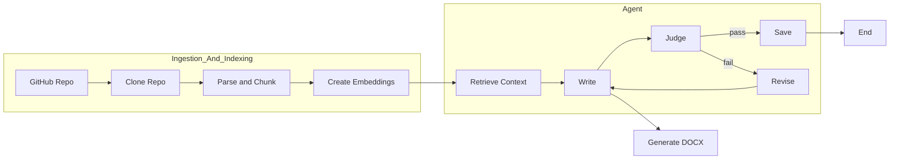
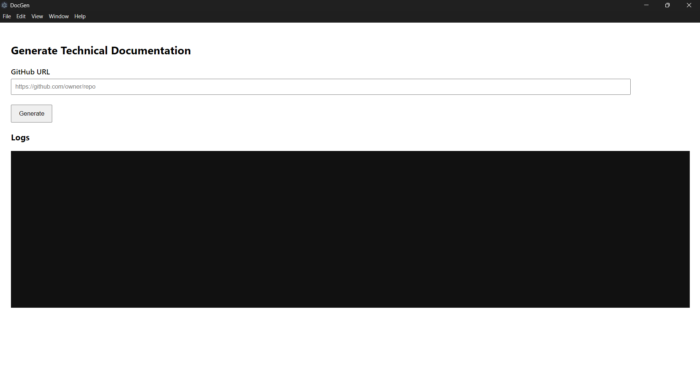

# 🧠 Auto Doc Gen — Evidence-Grounded Technical Documentation from Any GitHub Repo

[](LICENSE)


> Paste a GitHub URL → get a Word-ready, **evidence-cited** handover document.  
> Local app with retrieval-augmented generation (RAG), a **judge** for factuality/citations, Mermaid→image rendering, and one-click DOCX export.

---

## ✨ Features

- **One-click docs from a repo**  
  Clone, analyze, and generate an ordered handover: **Objective & Scope → Installation & Setup → Technologies Used → System Architecture → API Key**.

- **Evidence-grounded writing**  
  Dual **FAISS** indexes (Text + Code) and **section-aware retrieval** keep claims tied to real repo content.

- **Inline citations**  
  Substantive statements cite `file:line–line` (e.g., `[app/imports.py:12–28]`). If evidence is missing, we insert **[Information not available in repository]**.

- **Quality gate (“LLM-as-judge”)**  
  A second model verifies **factuality**, **citations**, and **missing-but-expected** items; verdicts saved as JSON for audit.

- **Word-friendly diagrams**
  The app **automatically creates a Mermaid system architecture diagram**, and all Mermaid blocks are rendered to **PNG** so diagrams show up correctly in DOCX.

- **Local-first**  
  Everything runs on your machine; only embeddings/LLM calls use your configured provider key.

---

## 🏗️ System Architecture



---

## 🖼️ UI Preview



---

## 🚀 Quick Start

**Requirements**

- **Python** 3.10+ (3.11 recommended)
- **Node.js** 18+ (for the Electron UI)
- Git
- An embeddings/LLM API key (e.g., `OPENAI_API_KEY`)

### 1) Clone

```bash
git clone https://github.com/<your-org-or-user>/<your-repo>.git
cd <your-repo>
````

### 2) Python env + deps

```bash
# Windows
python -m venv project_view
project_view\Scripts\activate
pip install -r requirements.txt

# macOS/Linux
python3 -m venv project_view
source project_view/bin/activate
pip install -r requirements.txt
```

### 3) Configure secrets

Create `app/.env`:

```env
OPENAI_API_KEY=YOUR_KEY_HERE
# Optional:
# OPENAI_BASE_URL=...
# GITHUB_TOKEN=...   # to access private repos or raise rate limits
```

### 4) UI deps (Electron) + Mermaid CLI

```bash
cd ui
npm install
# Mermaid CLI to render diagrams to images for Word:
npm install --save-dev @mermaid-js/mermaid-cli
```

### 5) Run the Desktop App

Ensure the UI uses your venv’s Python:

```bash
# Windows (PowerShell)
$env:PYTHON="$PWD\..\project_view\Scripts\python.exe"; npm start

# Windows (cmd)
set PYTHON=%cd%\..\project_view\Scripts\python.exe
npm start

# macOS/Linux
PYTHON="$PWD/../project_view/bin/python" npm start
```

Paste a GitHub URL, click **Generate**, watch logs, then **Save** the DOCX.

---

## 🧩 How It Works (High Level)

1. **Ingest** — Clone the repo; collect README/docs and source code.
2. **Chunk**
   - **Text** via paragraph/heading splits
   - **Code** via **AST** (functions/classes) → precise `file:line` spans
3. **Index** — Build **two FAISS stores** (Text **and** Code) with embeddings.
4. **Generate per section** — Retrieve most relevant chunks → LLM writes **grounded** prose with inline citations.
5. **Judge** — Second LLM checks factuality, citations, and missing items; JSON verdicts saved to `app/debug/`.
6. **Assemble** — Electron merges Markdown, renders Mermaid to **PNG**, adds a **cover page** (repo title), imposes your **section order**, then converts HTML → **DOCX**.

**Artifacts saved**

- `app/docs/` — final Markdown per section
- `app/docs_index/` — FAISS stores (text_index/, code_index/)
- `app/debug/` — judge JSONs per section

---

## 📁 Project Structure

```
<your-repo>/
├─ app/
│  ├─ main.py
│  ├─ imports.py
│  ├─ chunking.py
│  ├─ graph.py
│  ├─ save_to_vector_db.py
│  ├─ sections.yaml
│  ├─ .env                  # your API keys (not committed)
│  ├─ docs/                 # generated sections (Markdown)
│  ├─ docs_index/           # FAISS stores (text_index/, code_index/)
│  └─ debug/                # judge JSONs and run logs
├─ ui/
│  ├─ index.html
│  ├─ preload.js
│  └─ main.js               # spawns Python, Mermaid→PNG, DOCX export
├─ requirements.txt
├─ package.json (in /ui)
└─ LICENSE
```

---

## 🧷 Citations & Judge

- **Inline citations**:  
  `... reads env vars [app/imports.py:12–28].`
- **Missing evidence**:  
  `[Information not available in repository]` (no guessing).
- **Judge JSON (per section)**:
  ```json
  {
    "factual": true,
    "cites_ok": true,
    "hallucinated": false,
    "missing_but_expected": ["Specific environment variables..."],
    "score": 0.9,
    "notes": "..."
  }
  ```

Use these for quality gates (CI) or quick manual edits.

---

## 🔧 Troubleshooting

- **`ModuleNotFoundError: docx`**  
  Install into the same venv used by Electron:  
  `project_view\Scripts\python.exe -m pip install python-docx`

- **UnicodeEncodeError on Windows**  
  Ensure UTF-8: the UI already sets `PYTHONUTF8=1` / `PYTHONIOENCODING=utf-8`.

- **Mermaid not rendered**  
  Install `@mermaid-js/mermaid-cli` and ensure Chromium is available.

---

## 🛠 Tech Stack

**Desktop & Glue**  
Electron (Node + Chromium), `html-to-docx`, `@mermaid-js/mermaid-cli`

**Python Pipeline**  
LangChain / LangGraph, FAISS, GitPython, Tiktoken, (optional) `python-docx`

**Models**  
Your provider’s embeddings + LLM (configured in `app/.env`)

---

## 🗺️ Roadmap

- **Human-in-the-Loop review** UI (approve/revise sections)
- **Interactive Docs (RAG chat)** over the indexed repo
- **Multilingual output** (bilingual DOCX/PDF)
- **Delta docs** (incremental re-runs on diffs)
- **CI integration** with quality gates (fail on low judge score)
- **Richer sections** (Testing, Data model, Security, Ops)
- **Env-var detector** to auto-build `.env.example`
- **Offline/On-prem mode** (local embeddings/LLM)
- **More diagrams** (sequence/ER diagrams)

---

## 📚 References (Background)

- Naimi et al., _Automating Software Documentation_ (2024) — diagram-centric (UML → LLM) documentation.
- Thota et al., _AI-Driven Automated Software Documentation Generation_ (ICDSNS 2024) — model comparison for snippet-level code→text.

> Our system differs by mining the **entire repository** with **RAG + judge**, packaging a **Word-ready** handover with rendered diagrams.

---

## 🤝 Contributing

1. Fork → create a feature branch → commit → open PR.
2. Follow PEP 8 (Python) / standard JS style.
3. Include/update docs and, if possible, a small test repo URL for validation.

---

## 📝 License

This project is released under the **MIT License**. See [LICENSE](LICENSE).

---

> **TL;DR**: Paste a GitHub URL → get a structured, evidence-cited **DOCX** handover. Local, reproducible, and audit-friendly.
